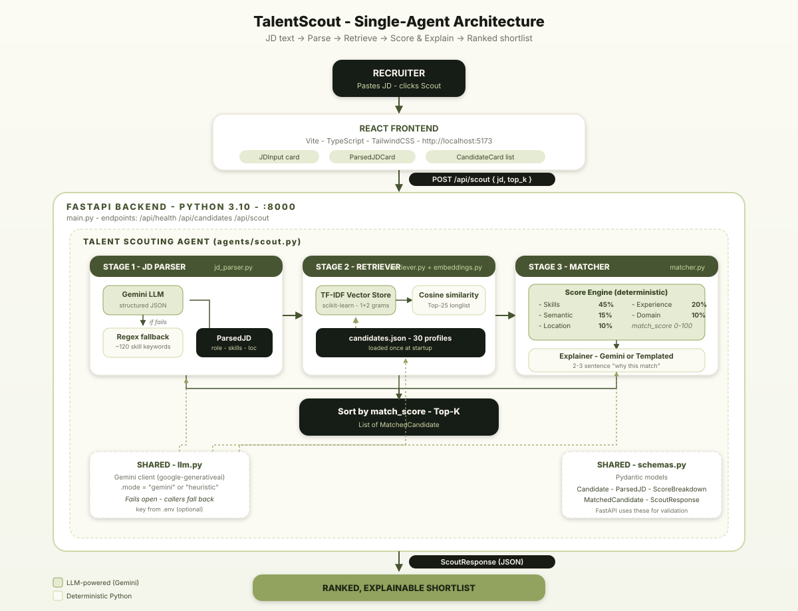

# TalentScout — AI Talent Scouting Agent

A single-agent system that turns a raw Job Description into a **ranked, explainable candidate shortlist** in seconds — replacing hours of manual profile-sifting with deterministic multi-dimensional scoring and LLM-powered explanations.

## What it does

1. **Parses the JD** — extracts role, seniority, must-have / nice-to-have skills, location, work mode, and domains from free text.
2. **Retrieves candidates** — hybrid search over a candidate pool (semantic similarity via TF-IDF + skill/domain keyword signals).
3. **Scores & explains** — every candidate gets a 0-100 Match Score across **5 dimensions** (Skills, Experience, Domain, Location, Semantic) plus a human-readable explanation grounded in their actual profile.

## Tech stack

**Backend** (`backend/`)
- Python 3.10 + FastAPI + Pydantic
- scikit-learn TF-IDF + cosine similarity (lightweight, no PyTorch)
- Google Gemini for JD parsing & natural-language explanations (free tier)
- **Heuristic fallback** — works fully without any API key

**Frontend** (`frontend/`)
- React 18 + TypeScript + Vite
- TailwindCSS (custom olive/cream design system)

**Data**
- 30 synthetic but realistic candidate profiles (`backend/app/data/candidates.json`) covering backend, frontend, ML, GenAI, design, PM, DevOps, security, and more.

## Project structure

```
backend/
  app/
    agents/scout.py           # The Talent Scouting Agent orchestrator
    services/
      jd_parser.py            # JD → structured ParsedJD (LLM + heuristic)
      embeddings.py           # TF-IDF vector store
      retriever.py            # Hybrid retrieval
      matcher.py              # 5-dimensional scoring + explanations
      llm.py                  # Gemini client with graceful fallback
    models/schemas.py         # Pydantic models
    data/candidates.json      # Candidate pool
    main.py                   # FastAPI app
  requirements.txt
  .env.example
frontend/
  src/
    App.tsx
    components/               # JDInput, ParsedJDCard, CandidateCard
    types.ts
  package.json
architecture.svg              # System architecture diagram
README.md
```

## Quickstart

### 1. Backend

```bash
cd backend
python -m venv .venv
.\.venv\Scripts\activate     # PowerShell on Windows
pip install -r requirements.txt

# Optional: get a free Gemini key from https://aistudio.google.com/app/apikey
copy .env.example .env       # then paste your key into .env

python -m uvicorn app.main:app --reload --port 8000
```

Backend runs at `http://localhost:8000`. Try `GET /api/health` to confirm.

### 2. Frontend

```bash
cd frontend
npm install
npm run dev
```

Open `http://localhost:5173`. The Vite dev server proxies `/api/*` → `http://localhost:8000`.

## Usage

1. Paste a JD (or pick one of the 3 built-in samples).
2. Slide the "Top results" control (3–15).
3. Click **Scout Candidates**.

You'll get:
- A **Parsed JD** card showing exactly what was extracted (must-haves, nice-to-haves, location, domains).
- A **ranked shortlist** with score rings, matched/missing skill chips, breakdown bars, and a 2-3 sentence explanation per candidate.

## Architecture



The agent runs as a **single orchestrator** (`agents/scout.py`) that drives three deterministic stages, each with an optional LLM accelerator:

| Stage | Module | What happens | LLM? |
|---|---|---|---|
| **1. JD Parser** | `services/jd_parser.py` | Free-text JD → `ParsedJD` (role, seniority, must/nice skills, domains, location, work mode) | Gemini for structured extraction; **regex + ~120-keyword skill dictionary** as fallback |
| **2. Retriever** | `services/embeddings.py` + `retriever.py` | TF-IDF (1+2 grams) vectorises every candidate at startup; cosine similarity against a JD query string returns a **Top-25 longlist** | Pure scikit-learn, deterministic |
| **3. Matcher** | `services/matcher.py` | Each long-listed candidate gets a 5-dimensional `ScoreBreakdown`, a composite `match_score`, and a 2-3 sentence explanation | Gemini for explanations; **templated explainer** as fallback |

A shared `services/llm.py` wraps Gemini with a `mode` flag (`"gemini"` or `"heuristic"`) and **fails open** — every LLM call has a deterministic fallback so the agent works fully without an API key.

## Scoring & Logic

The composite **Match Score (0-100)** is a weighted sum of five sub-scores:

```
match_score = 0.45 · skills
            + 0.20 · experience
            + 0.15 · semantic
            + 0.10 · domain
            + 0.10 · location
```

### How each dimension is computed

- **Skills (45%)** — `0.85 · must_have_ratio + 0.15 · nice_to_have_ratio`, normalised to 0-100. A perfect must-have match adds a `+5` calibration bonus (capped at 100).
- **Experience (20%)** — full marks if the candidate's years fall inside the parsed `[min_years, max_years]` window. Linear penalty below the floor (`-25` per year), gentler penalty above the ceiling (`-8` per year, floor 40) to avoid harshly punishing seniors.
- **Semantic (15%)** — TF-IDF cosine similarity between the JD query and the candidate's profile text (`title + summary + skills + domains + location`). Captures fuzzy signals the keyword match misses (e.g. "distributed systems" implied by a Kafka-heavy summary).
- **Domain (10%)** — Jaccard-style overlap between JD domains and candidate domains. Any overlap → 60 + scaled bonus; no overlap → 40 (not zero, because skills usually transfer).
- **Location (10%)** — exact-city match → 95-100; same work-mode (e.g. both `remote`) → 90-100; remote-friendly candidate for an on-site role → 85; otherwise 60.

### Explainability

Every match returns:
- `matched_must_have` / `missing_must_have` skill chips (verbatim from the JD).
- `matched_nice_to_have` chips.
- A `breakdown` with all five sub-scores so the recruiter sees *why* a candidate ranked where they did.
- An `explanation` — Gemini-written when available ("Aarav has 7 years of fintech backend experience and matches 8/10 must-haves including AWS, Kubernetes, and FastAPI; only Distributed Systems and Kafka are missing"), templated otherwise.

## Sample Inputs & Outputs

### Input — `POST /api/scout`

```json
{
  "jd_text": "Senior Backend Engineer - Payments Platform\n\nWe are hiring a Senior Backend Engineer to scale our payments platform.\n\nRequirements:\n- 5+ years building production backend systems\n- Strong Python and FastAPI\n- Solid PostgreSQL and Redis\n- AWS and Docker required\n- Microservices and distributed systems mindset\n\nNice to have:\n- Kubernetes experience\n- Kafka or event-driven architectures\n- Fintech domain background\n\nLocation: Bangalore (hybrid). Remote OK.",
  "top_k": 3
}
```

### Output — `ScoutResponse` (real run, `llm_mode: "gemini"`)

```json
{
  "parsed_jd": {
    "role_title": "Senior Backend Engineer - Payments Platform",
    "seniority": "senior",
    "min_years_experience": 5,
    "max_years_experience": 13,
    "must_have_skills": ["Python", "FastAPI", "PostgreSQL", "Redis", "AWS", "Docker", "Microservices", "Distributed Systems", "Kubernetes", "Kafka"],
    "nice_to_have_skills": [],
    "domains": ["fintech"],
    "location": "Bangalore",
    "work_mode": ["hybrid", "remote"]
  },
  "matches": [
    {
      "candidate": {
        "id": "c001",
        "name": "Aarav Sharma",
        "title": "Senior Backend Engineer",
        "years_experience": 7,
        "location": "Bangalore, India",
        "skills": ["Python", "FastAPI", "PostgreSQL", "AWS", "Docker", "Kubernetes", "Redis", "Microservices"],
        "domains": ["fintech", "saas"],
        "current_company": "PaySwift"
      },
      "match_score": 76.0,
      "breakdown": {
        "skills_score": 68.0,
        "experience_score": 100.0,
        "domain_score": 80.0,
        "location_score": 100.0,
        "semantic_score": 49.6
      },
      "matched_must_have": ["AWS", "Redis", "Microservices", "PostgreSQL", "Kubernetes", "Docker", "Python", "FastAPI"],
      "missing_must_have": ["Distributed Systems", "Kafka"],
      "explanation": "Matches 8/10 must-have skills (AWS, Redis, Microservices, PostgreSQL, Kubernetes, Docker, Python, FastAPI). Missing: Distributed Systems, Kafka. 7 yrs experience fits the 5-13 yr target. Domain overlap: fintech. Location & work-mode align well."
    },
    {
      "candidate": {
        "id": "c023",
        "name": "Rajesh Pillai",
        "title": "Lead Backend Engineer",
        "years_experience": 10,
        "location": "Bangalore, India",
        "skills": ["Python", "Django", "FastAPI", "PostgreSQL", "Redis", "Celery", "AWS", "Kubernetes", "System Design"],
        "domains": ["saas", "fintech"]
      },
      "match_score": 63.9,
      "breakdown": { "skills_score": 51.0, "experience_score": 100.0, "domain_score": 80.0, "location_score": 100.0, "semantic_score": 19.4 },
      "matched_must_have": ["AWS", "Redis", "PostgreSQL", "Kubernetes", "Python", "FastAPI"],
      "missing_must_have": ["Distributed Systems", "Microservices", "Docker", "Kafka"]
    },
    {
      "candidate": {
        "id": "c011",
        "name": "Karthik Rao",
        "title": "Senior Backend Engineer",
        "years_experience": 9,
        "location": "Chennai, India",
        "skills": ["Go", "gRPC", "PostgreSQL", "Kafka", "Redis", "Docker", "Kubernetes", "Microservices"],
        "domains": ["fintech", "trading"]
      },
      "match_score": 61.6,
      "breakdown": { "skills_score": 51.0, "experience_score": 100.0, "domain_score": 80.0, "location_score": 60.0, "semantic_score": 31.2 },
      "matched_must_have": ["Redis", "Microservices", "PostgreSQL", "Kubernetes", "Docker", "Kafka"],
      "missing_must_have": ["Distributed Systems", "AWS", "Python", "FastAPI"]
    }
  ],
  "total_candidates_considered": 30,
  "llm_mode": "gemini"
}
```

**How to read it:** Aarav (76.0) wins because he hits 8/10 must-haves *and* sits in Bangalore on hybrid; Rajesh (63.9) is also Bangalore-based but missing Microservices/Docker/Kafka pulls him down; Karthik (61.6) has Kafka and matches 6/10 but loses ground on location (Chennai) and language (Go vs. the JD's Python).

## API

`POST /api/scout`
```json
{ "jd_text": "Senior Backend Engineer …", "top_k": 8 }
```
Response is a `ScoutResponse` containing the parsed JD, ranked matches with full breakdowns, and the active `llm_mode` (`gemini` or `heuristic`).

`GET /api/health` — liveness + LLM mode + pool size.
`GET /api/candidates` — full candidate pool (debug).

## Extending

- **Plug in a real ATS** — replace `app/data/candidates.json` and re-run; the embedding store rebuilds at startup.
- **Swap the LLM** — `app/services/llm.py` is provider-agnostic; point it at OpenAI / Anthropic by editing `generate()`.
- **Add an Engagement Agent** — the natural next step is a conversational outreach agent that takes this shortlist and produces an Interest Score per candidate.
